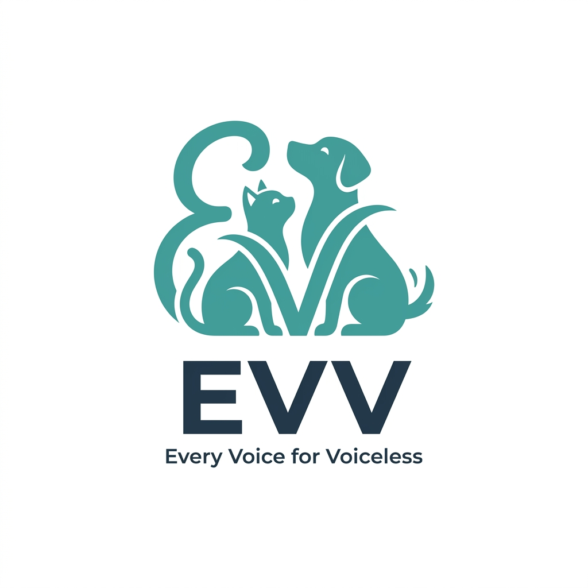

<p align="center">
  
</p>

<h1 align="center">EVV — Every Voice for Voiceless</h1>

<p align="center">
  <strong>A civic animal welfare platform that connects injured/stray animals with volunteers, NGOs, and food donors.</strong><br>
  <i>"Be the voice they never had."</i>
</p>

<p align="center">
  <a href="https://reactjs.org/"></a>
  <a href="https://nodejs.org/"></a>
  <a href="https://www.mongodb.com/"></a>
  <a href="https://tailwindcss.com/"></a>
</p>

<br />

## 🌟 The Mission
The system of helping stray animals is often fragmented. EVV acts as the missing layer, seamlessly connecting people who want to help but lack resources (students, passersby) with existing resources (NGOs, food donors, volunteers). We ensure that zero food goes to waste and every injured animal gets reported within seconds.

---

## 🚀 Core Features
- **🚨 Rescue Reporter**: Spot an injured animal? Snap a photo. We automatically attach your GPS coordinates and notify NGOs nearby.
- **🍱 Food Connect**: Restaurants and individuals can post excess, leftover food. Verified feeders are pinged to pick it up and feed local strays.
- **🤝 Volunteer Hub**: Claim tasks locally. Can't adopt? You can still transport an injured animal or distribute food.
- **📍 Live Incident Map**: A real-time heatmap (powered by `react-leaflet`) highlighting ongoing rescues and available food locations.
- **📱 PWA Ready**: Install EVV on any device directly from the browser for offline caching and fast mobile access.

---

## 🛠 Tech Stack

### Frontend
- **React.js 18** + **Vite** (Fast compilation)
- **Tailwind CSS v4** + Custom Glassmorphism UI
- **Framer Motion** (Fluid micro-animations)
- **Leaflet.js** (OpenStreetMap implementation)
- **Socket.io Client** (Real-time updates)

### Backend
- **Node.js** + **Express**
- **MongoDB** + **Mongoose** (With `2dsphere` indexes for geo-queries)
- **JWT** (JSON Web Tokens via dynamic OTP generation)
- **Cloudinary** (Image hosting and buffering)
- **Socket.io** (Real-time broadcasting)

---

## ⚙️ Getting Started

Follow these steps to set up EVV locally on your machine.

### Prerequisites
- [Node.js](https://nodejs.org/en/) (v16 or higher)
- [MongoDB](https://www.mongodb.com/) (Local instance or Atlas cluster)
- [Cloudinary Account](https://cloudinary.com/) (For image uploads)

### 1. Clone the Repository
```bash
git clone https://github.com/your-username/evv.git
cd evv
```

### 2. Backend Setup
Navigate to the backend folder and install dependencies:
```bash
cd backend
npm install
```

Create a `.env` file in the `backend` directory:
```env
# Server Configuration
PORT=5000

# Database Configuration
MONGODB_URI=mongodb://localhost:27017/evv_db

# Security
JWT_SECRET=your_super_secret_jwt_key_here

# Cloudinary Setup (Required for Image Uploads)
CLOUDINARY_CLOUD_NAME=your_cloud_name
CLOUDINARY_API_KEY=your_api_key
CLOUDINARY_API_SECRET=your_api_secret
```

Start the backend server:
```bash
npm start
# or for development:
npm run dev
```

### 3. Frontend Setup
Open a new terminal, navigate to the frontend folder, and install dependencies:
```bash
cd frontend
npm install
```

Start the development server:
```bash
npm run dev
```
Access the application at: `http://localhost:5173`

---

## 🧪 Authentication & Testing (OTP Flow)
Since this app is configured for production, it uses a dynamic OTP generation system. 
1. Go to the Login/Profile screen.
2. Enter your phone number.
3. Check the **Backend Terminal/Console** to view your dynamically generated 6-digit OTP.
4. Enter the OTP into the frontend to log in securely.

---

## 🌍 Directory Structure
```text
evv/
├── backend/                  # Express API
│   ├── middleware/           # Auth and Upload validation
│   ├── models/               # MongoDB Schemas (User, RescueReport, FoodDonation, NGO)
│   ├── routes/               # API Endpoints
│   ├── socket/               # Real-time WebSocket controllers
│   ├── utils/                # Cloudinary configurations
│   └── server.js             # Main server entrypoint
│
└── frontend/                 # React Application
    ├── public/               # Manifest, PWA Service Worker, Assets
    └── src/
        ├── components/       # Reusable UI (Cards, Maps, Badges, Navbars)
        ├── context/          # Global State (Auth, Socket)
        ├── hooks/            # Custom Hooks (useLocation)
        ├── pages/            # View Controllers (Landing, Dashboard, Report, etc.)
        ├── App.jsx           # Routing wrapper
        └── main.jsx          # React DOM entrypoint
```

---

## 🤝 Contributing
We welcome contributions from the civic tech and open-source community! 
1. Fork the Project
2. Create your Feature Branch (`git checkout -b feature/AmazingFeature`)
3. Commit your Changes (`git commit -m 'Add some AmazingFeature'`)
4. Push to the Branch (`git push origin feature/AmazingFeature`)
5. Open a Pull Request

---

## 📄 License
This project is licensed under the MIT License - see the LICENSE file for details.

---

<p align="center">
  <i>Built with ❤️ by tech enthusiasts for the voiceless.</i>
</p>